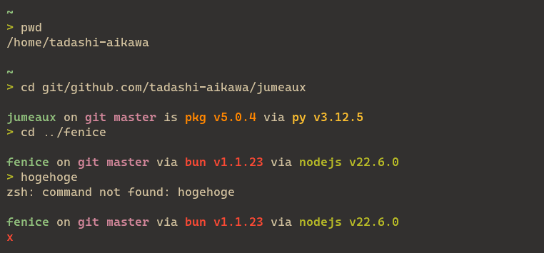
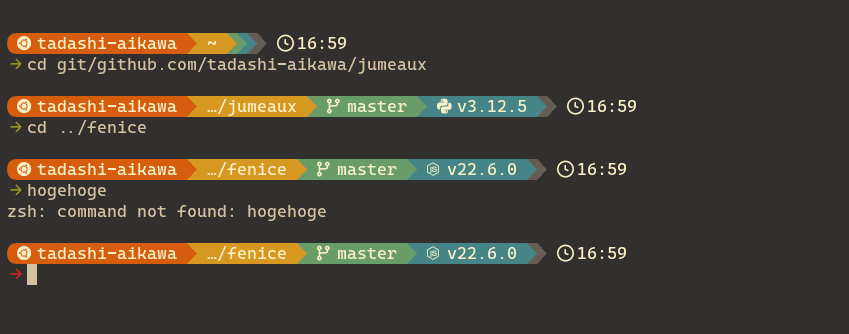
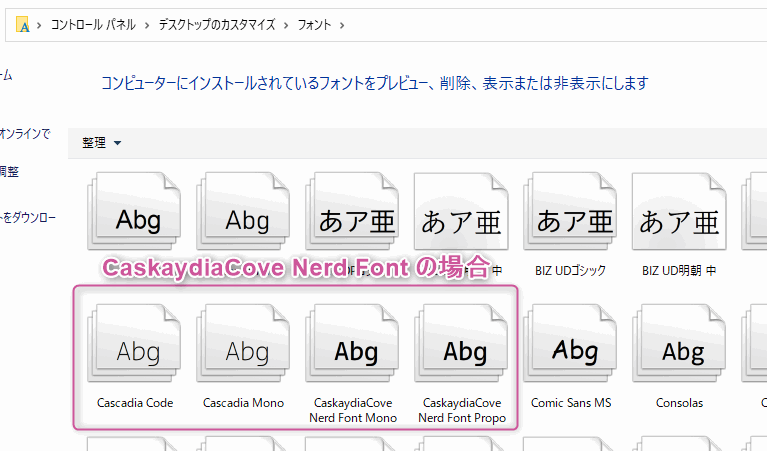
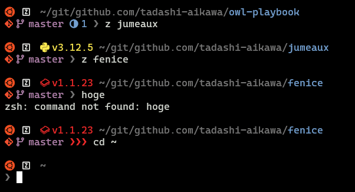

<script src="https://cdn.tailwindcss.com/3.4.4"></script>
<script>tailwind.config = { corePlugins: { preflight: false } }</script>

<!-- _class: slide-title -->

<div class="title">
  <div>ターミナルに欠かせない2つのツール</div>
  <div>mise & Starship</div>
</div>
<div class="name">Tadashi Aikawa</div>
<div class="date-and-event">2024/08/18 Minerva Lightning Talks</div>

---


<style scoped>
.item {
  display: flex;
  align-items: center;
  gap: 0.75em;
}
</style>

<div>
  <h1 class="text-foreground">Tadashi Aikawa</h1>
  <h5 class="text-dimmed">Productivity Creator since 2010</h5>
  <div class="mt-12 space-y-2 text-2xl">
    <div class="item">
      <div class="label">OS</div>
      <span>Windows <small>(開発はUbuntu on WSL)</small></span>
    </div>
    <div class="item">
      <div class="label">言語</div>
      <span>TypeScript >> Python = Go = Rust >> Lua</span>
    </div>
    <div class="item">
      <div class="label">エディタ</div>
      <span>Neovim / Obsidian</span>
    </div>
    <div class="item">
      <div class="label">デバイス</div>
      <span>EIZO / HHKB Studio / SlimBlade</span>
    </div>
    <div class="item">
      <div class="label">サイト</div>
      <a href="https://minerva.mamansoft.net/">Minerva</a>
      <a href="https://github.com/tadashi-aikawa">GitHub</a>
      <a href="https://bsky.app/profile/tadashi-aikawa.bsky.social">
        Bluesky
      </a>
    </div>
    <div class="item">
      <div class="label">好き</div>
      <span>創作活動・温泉・甘味・動物(ぬいぐるみ含む)</span>
    </div>
    <div class="item">
      <div class="label">苦手</div>
      <span>お酒・車・勉強</span>
    </div>
    <div class="item">
      <div class="label">楽しい仕事</div>
      <span>個人やチームの生産性を上げて成果に繋げる</span>
    </div>
  </div>
</div>

<!-- 仕事だったら『所属』『代表プロダクト』『入社年』などを入れる -->

---

<!-- _class: chapter-divider -->

<div class="left">

### Agenda

</div>

<div class="right">

1. miseのキホン
2. Starshipのキホン
3. Starshipで見た目をカスタマイズ
4. miseでツールバージョンを管理する
5. まとめ

</div>

---

<!-- _class: chapter-divider -->

<div class="left">

### Chapter

## 01

</div>

<div class="right">

1. **miseのキホン**
2. Starshipのキホン
3. Starshipで見た目をカスタマイズ
4. miseでツールバージョンを管理する
5. まとめ

</div>

---

## miseとは直感的に利用できるツール管理環境

<iframe src="https://mise.jdx.dev/" width="100%" height="540" frameborder="0" allowfullscreen class="mt-6"></iframe>

<footer>

[Home \| mise\-en\-place](https://mise.jdx.dev/)

</footer>

---

## miseを勧めたい3つのポイント

<div class="grid-col-div-3 mt-12 text-primary">

  <i class="nf nf-md-package_variant_closed text-[3em]"></i>

  <i class="nf nf-cod-versions text-[3em]"></i>

  <i class="nf nf-md-clock_fast text-[3em]"></i>

</div>

<div class="grid-col-div-3 pt-4">
  <div class="text-3xl font-bold">直感的なツール管理</div>
  <div class="text-3xl font-bold">楽々バージョン切替</div>
  <div class="text-3xl font-bold">高パフォーマンス</div>
</div>

<div class="grid-col-div-3 text-justify" style="place-items: start;">
  <div class="text-2xl">

  `mise install`コマンドでツール(言語/CLI)をインストールできる。各ツールのバージョンを指定したり、複数のバージョンをインストールしたりもできる。各ツールのバージョンはtomlファイルなどで管理できるため、バージョン管理して共有も可能。

  </div>
  <div class="text-2xl">
  
  `mise use`コマンドでグローバル、またはカレントディレクトリ配下で利用するツールのバージョンを指定できる。PythonやNode、Goのバージョン差分に悩まされることもなくなり、ツールの新バージョンに問題があった場合も速やかにリバート可能。

  </div>
  <div class="text-2xl">

  この手のツールにありがちなコマンド実行時のオーバーヘッドがない。その理由はshimを使わずに環境変数`PATH`を直接書き換える設計になっているから。miseはRustで開発されているため、`PATH`を変更する処理自体も20ms以下と高速であり実用的。

  </div>
</div>

---

## miseのインストール

1. `curl https://mise.run | sh`
2. rcファイルにactivate処理を追加 (下部のcode blockが実行コマンド)
3. ターミナルで新しいセッションを立ち上げる
4. `mise --version`

```bash
# bashの場合
echo 'eval "$(~/.local/bin/mise activate bash)"' >> ~/.bashrc
# zshの場合
echo 'eval "$(~/.local/bin/mise activate zsh)"' >> ~/.zshrc
```

---

## miseでツールをインストールしてみる

```bash
# Goの最新版をインストールし、それをPATHで指定する
mise use -g go
```

```bash
# インストール場所とバージョンの確認
$ which go
~/.local/share/mise/installs/go/1.23.0/bin/go
$ go version
go version go1.23.0 linux/amd64
```

---

## Chapter 01 のまとめ

- miseとは直感的に利用できるツール管理環境
- miseはプログラミング言語/環境、CLIなどのツールをインストールできる
- `mise use`コマンドを使うとインストールとPATH指定を同時に行える

---

<!-- _class: chapter-divider -->

<div class="left">

### Chapter

## 02

</div>

<div class="right">

1. ~~miseのキホン~~
2. **Starshipのキホン**
3. Starshipで見た目をカスタマイズ
4. miseでツールバージョンを管理する
5. まとめ

</div>

---

## Starshipとはプロンプトのカスタマイズツール

<iframe src="https://starship.rs/" width="100%" height="540" frameborder="0" allowfullscreen class="mt-6"></iframe>

<footer>

[Starship](https://starship.rs/)

</footer>

---

## Starshipを勧めたい3つのポイント

<div class="grid-col-div-3 mt-12 text-primary">

  <i class="nf nf-seti-config text-[3em]"></i>

  <i class="nf nf-md-toolbox_outline text-[3em]"></i>

  <i class="nf nf-oct-terminal text-[3em]"></i>

</div>

<div class="grid-col-div-3 pt-4">
  <div class="text-3xl font-bold">直感的な設定</div>
  <div class="text-3xl font-bold">高いカスタマイズ性</div>
  <div class="text-3xl font-bold">あらゆるシェルに対応</div>
</div>

<div class="grid-col-div-3 text-justify" style="place-items: start;">
  <div class="text-2xl">

  プロンプトの表示内容を制御するための設定は、TOMLファイルで簡潔に書ける。特に拘りがなければ、予め用意されたプリセットを指定するだけで、ターミナルの見た目がオシャレになる。

  </div>
  <div class="text-2xl">

  
  プリセットよりも細かくカスタマイズしたい場合は、100近くあるモジュールを組み合わせて自分だけのプロンプトをカスタマイズできる。任意のコマンド実行結果を表示することも可能。

  </div>
  <div class="text-2xl">

  プリセットやモジュールを使って構築したプロンプトの設定は、あらゆるシェルで使いまわせる。Bash, Zsh, fishはもちろんのこと、PowerShell、そしてなんとCmdにも対応している。

  </div>
</div>

---

## Starshipのインストール

1. `mise use -g starship`
2. rcファイルに起動処理を追加 (下部のcode blockが実行コマンド)
3. `starship preset plain-text-symbols -o ~/.config/starship.toml`
4. ターミナルで新しいセッションを立ち上げる

```bash
# bashの場合
echo 'eval "$(mise x -- starship init bash)"' >> ~/.bashrc
# zshの場合
echo 'eval "$(mise x -- starship init zsh)"' >> ~/.zshrc
```

---

## こんな感じになっていればOK



---

<!-- _class: chapter-divider -->

<div class="left">

### Chapter

## 03

</div>

<div class="right">

1. ~~miseのキホン~~
2. ~~Starshipのキホン~~
3. **Starshipで見た目をカスタマイズ**
4. miseでツールバージョンを管理する
5. まとめ

</div>

---


---

<!-- _class: full lead text-dimmed-background -->

<h2 class="z-50">ぶっちゃけあまりカッコよくないですよね？</h2>


<div class="absolute bg-black/75 w-full h-full"></div>

---

## こういうイメージではないでしょうか？



---

## オシャレなプロンプトにはNerd Fontが必要

<iframe src="https://www.nerdfonts.com/" width="100%" height="540" frameborder="0" allowfullscreen class="mt-6"></iframe>

<footer>

[ \- Iconic font aggregator, glyphs/icons collection, & fonts patcher](https://www.nerdfonts.com/)

</footer>

---

## Nerd Fontのダウンロード

<iframe src="https://www.nerdfonts.com/font-downloads" width="100%" height="540" frameborder="0" allowfullscreen class="mt-6"></iframe>

<footer>

[ \- Iconic font aggregator, glyphs/icons collection, & fonts patcher](https://www.nerdfonts.com/font-downloads)

</footer>

---

## Nerd Fontのインストール

1. _ターミナルがインストールされているOSの_ フォント設定を開く
2. ダウンロードしたzipファイルを解凍
3. `*.ttf`ファイルをフォント設定にドラッグ&ドロップ



---

## Nerd Fontをターミナルに適応

1. ターミナルのフォント設定を変更
2. `󰏒 ` をターミナルに貼り付けてフクロウが表示されればOK

```json
// Windows Terminalの場合はJSONでfont.faceに設定
{
  "profiles": {
    "defaults": {
      "font": {
        "face": "CaskaydiaCove Nerd Font",
        "size": 13.0
      }
    }
  }
}
```

---

## Starshipのプリセット一覧

<iframe src="https://starship.rs/presets/" width="100%" height="540" frameborder="0" allowfullscreen class="mt-6"></iframe>

<footer>

[Presets \| Starship](https://starship.rs/presets/)

</footer>

---

## Starshipのプリセットを適応

```bash
# Gruvbox Rainbow Presetの場合
starship preset gruvbox-rainbow -o ~/.config/starship.toml
```

```toml
# ~/.config/starship.toml
"$schema" = 'https://starship.rs/config-schema.json'

format = """
[](color_orange)\
$os\
$username\
[](bg:color_yellow fg:color_orange)\
$directory\
[](fg:color_yellow bg:color_aqua)\
$git_branch\
$git_status\
# ...以下略
```

---

## うまくできていればこうなるはず


---

## TOMLをいじると自分好みにカスタマイズできる

<p>
  
</p>


---

## TOMLの書き方とモジュール一覧

<iframe src="https://starship.rs/config/" width="100%" height="540" frameborder="0" allowfullscreen class="mt-6"></iframe>

<footer>

[Configuration \| Starship](https://starship.rs/config/)

</footer>

---

<!-- _class: lead -->



<div class="flex items-center justify-center">

<i class="nf nf-cod-github mr-2"></i>

[私のstarship.toml](https://github.com/tadashi-aikawa/owl-playbook/blob/master/mnt/common/starship/starship.toml)

</div>

---

## Chapter 02 03 のまとめ

- Starshipとはプロンプトのカスタマイズツール
- `~/.config/starship.toml` で見た目をカスタマイズできる
- `starship preset` コマンドでプリセットのTOMLファイルを生成可能
- オシャレなターミナルにするならNerd Fontが必要

---

<!-- _class: chapter-divider -->

<div class="left">

## 

### Chapter

## 04

</div>

<div class="right">

1. ~~miseのキホン~~
2. ~~Starshipのキホン~~
3. ~~Starshipで見た目をカスタマイズ~~
4. **miseでツールバージョンを管理する**
5. まとめ

</div>

---

## goのバージョンを切り替えてみる

```bash
mise list go
mise use -g go@1.22
mise use -g go@1.23
```

<video muted controls src="./resources/mise-use-go.webm" height="400"></video>

---

## インストールしていないjqのバージョンを切り替えてみる

```bash
mise list-all jq
mise use -g jq@1.7
mise use -g jq@1.6
```

<video muted controls src="./resources/mise-use-jq.webm" height="400"></video>

---

## ディレクトリによってGoのバージョンを切り替える

```bash
mise use go@1.21
mise use go@1.22
```

<video muted controls src="./resources/mise-use-local-go.webm" height="400"></video>

---

## ツールをアップデートする

```bash
mise outdated
mise up delta
```

<div class="tag-note" style="right: 70px; top: 122px">
引数忘れて "mise up" にするとすべてアップデートされてしまうので注意
</div>

<video muted controls src="./resources/mise-outdated-up-delta.webm" height="400"></video>

---

## アップデートで最新バージョンが見つからない場合は...

- バージョン取得処理にはリモートとローカルに2つのキャッシュが存在する
- ゆえに、24時間以内にリリースされたバージョンが取得できないことがある
- 今すぐにバージョンを取得したい場合は...

```bash
# アップデート用の専用場所を作成
mkdir mise-update-sandbox
cd mise-update-sandbox
# この場所でのみバージョンをツールのGitHubから直接取得させる
mise set MISE_USE_VERSIONS_HOST=false
# 上記設定を信頼できるものとして有効にする
mise trust
# CLI(Local)のキャッシュをクリア
mise cache clear
# ツールをアップデート
mise up <アップデートしたいツール>
```

<footer>

[miseのツールバージョン取得方法 \- Minerva](https://minerva.mamansoft.net/Notes/mise%E3%81%AE%E3%83%84%E3%83%BC%E3%83%AB%E3%83%90%E3%83%BC%E3%82%B8%E3%83%A7%E3%83%B3%E5%8F%96%E5%BE%97%E6%96%B9%E6%B3%95)

</footer>

---

<!-- _class: chapter-divider -->

<div class="left">

### Chapter

## 05

</div>

<div class="right">

1. ~~miseのキホン~~
2. ~~Starshipのキホン~~
3. ~~Starshipで見た目をカスタマイズ~~
4. ~~miseでツールバージョンを管理する~~
5. **まとめ**

</div>

---

## まとめ

- mise
  - ツール(言語/CLI)をインストール、更新、複数バージョン保持できる
  - グローバルまたはディレクトリごとにツールのバージョンを指定できる
  - PATHを切り替える設計 & Rust製により非常に高速
- Starship
  - `starship.toml` をいじることでプロンプトを簡単にカスタマイズできる
  - ↑の設定ファイルはBash, Zshなど複数のシェルで利用できる
  - ただし、オシャレなターミナルにするにはNerd Fontが必要

<!--
_paginate: false
_backgroundImage: url("https://publish-01.obsidian.md/access/35d05cd1bf5cc500e11cc8ba57daaf88/Attachments/mimizou-momochi.gif")
_backgroundSize: 100px
_backgroundPosition: right bottom
-->

---

<!-- _class: slide-last -->

# Starshipでモチベを上げ

# miseで便利なツールを使いこなそう

#### 以上です
