<script src="https://cdn.tailwindcss.com/3.4.4"></script>
<script>tailwind.config = { corePlugins: { preflight: false } }</script>

<!-- _class: slide-title relateive -->

<div class="title">
  <div>Chrome拡張のつくり方</div>
</div>
<div class="name">Tadashi Aikawa</div>
<div class="date-and-event">2024/12/22 Minerva Lightning Talks</div>

---


<style scoped>
.item {
  display: flex;
  align-items: center;
  gap: 0.75em;
}
</style>

<div>
  <h1 class="text-foreground">Tadashi Aikawa</h1>
  <h5 class="text-dimmed">Productivity Creator since 2010</h5>
  <div class="mt-12 space-y-2 text-2xl">
    <div class="item">
      <div class="label">OS</div>
      <span>Windows <small>(開発はUbuntu on WSL)</small></span>
    </div>
    <div class="item">
      <div class="label">ターミナル</div>
      <span>Windows Terminal / WezTerm (secondary)</span>
    </div>
    <div class="item">
      <div class="label">言語</div>
      <span>TypeScript >> Python = Go > Lua > Rust</span>
    </div>
    <div class="item">
      <div class="label">エディタ</div>
      <span>Neovim / Obsidian</span>
    </div>
    <div class="item">
      <div class="label">デバイス</div>
      <span>EIZO / HHKB Studio / SlimBlade</span>
    </div>
    <div class="item">
      <div class="label">サイト</div>
      <a href="https://minerva.mamansoft.net/">Minerva</a>
      <a href="https://github.com/tadashi-aikawa">GitHub</a>
      <a href="https://bsky.app/profile/tadashi-aikawa.bsky.social">
        Bluesky
      </a>
    </div>
    <div class="item">
      <div class="label">好き</div>
      <span>創作活動・温泉・甘味・動物(ぬいぐるみ含む)</span>
    </div>
    <div class="item">
      <div class="label">苦手</div>
      <span>お酒・車・勉強</span>
    </div>
    <div class="item">
      <div class="label">楽しい仕事</div>
      <span>個人やチームの生産性を上げて成果に繋げる</span>
    </div>
  </div>
</div>

<!-- 仕事だったら『所属』『代表プロダクト』『入社年』などを入れる -->

---

<!-- _class: chapter-divider -->

<div class="left">

### Agenda

</div>

<div class="right">

1. 真にミニマムな拡張作成
2. 見た目を変える拡張作成
3. コンテンツをいじる拡張作成
4. SPAのような拡張作成

</div>

---

<!-- _class: chapter-divider -->

<div class="left">

### Chapter

## 01

</div>

<div class="right">

1. **真にミニマムな拡張作成**
2. 見た目を変える拡張作成
3. コンテンツをいじる拡張作成
4. SPAのような拡張作成

</div>

---

## Chrome拡張に必要な最低限のファイル

`manifest.json`

```json
{
  "manifest_version": 3,
  "name": "Sample Chrome Extension",
  "description": "Sample of the Chrome Extension",
  "version": "0.1.0"
}
```

---

## インストールしてみよう

1. `sample-chrome-extension` ディレクトリを作成する
2. 先ほどの `manifest.json` を `sample-chrome-extension` の中に作成

<div class="mt-32">

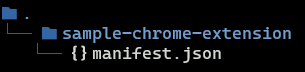

</div>

---

Google Chrome のアドレスバーに `chrome://extensions` と入力してEnter


---

`パッケージ化されていない拡張機能を読み込む` から先ほど作成したディレクトリを選択

<div class="flex gap-16">

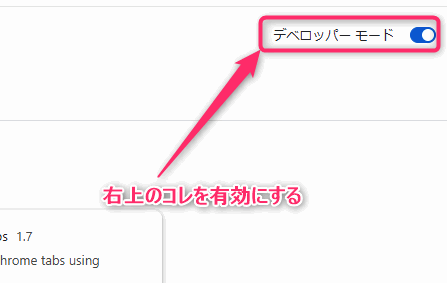

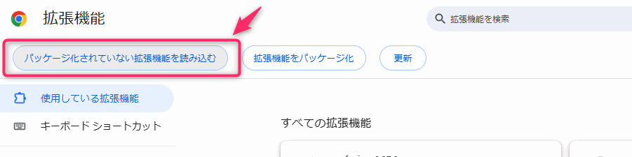

</div>

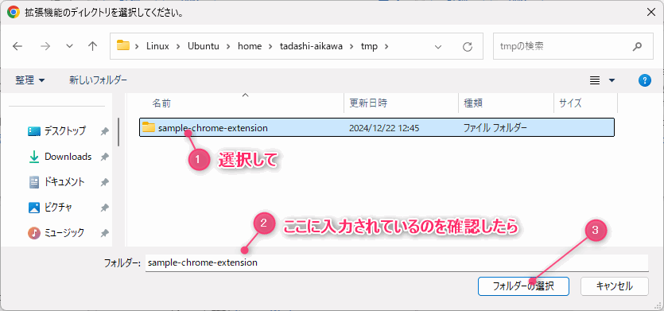

---

追加されていれば成功です🎉

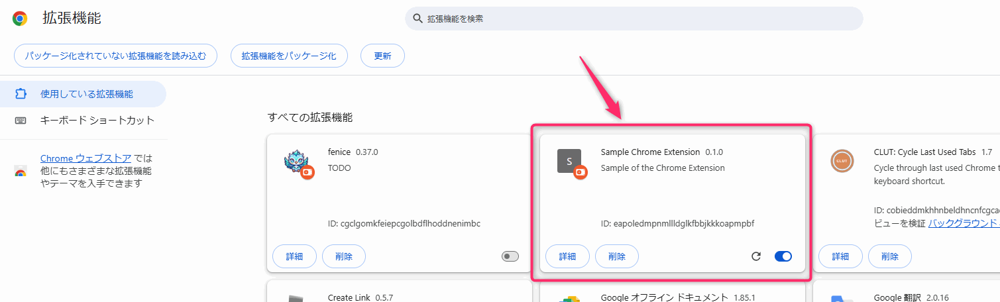

---

<!-- _class: chapter-divider -->

<div class="left">

### Chapter

## 02

</div>

<div class="right">

1. ~~真にミニマムな拡張作成~~
2. **見た目を変える拡張作成**
3. コンテンツをいじる拡張作成
4. SPAのような拡張作成

</div>

---

<!-- _class: lead -->

### 文字をすべて<span style="color: red">赤色</span>にする拡張をつくってみましょう

---

## 必要なもの

| ファイル名      | 備考                           |
| -               | -                              |
| **`main.css`**  | *見た目の設定を変更します*     |
| `manifest.json` | 先ほどより少し項目を追加します |

<div class="mt-32">

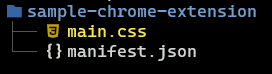

</div>

---

## CSSファイルの作成

`sample-chrome-extension` の中に `main.css` を作成します。

```css
* {
  color: red !important;
}
```

<div class="note">

※ 他の指定より優先するため `!important` をつけています

</div>

---

## すべてのWebページでCSSを適応

`manifest.json` を編集します。

```json
{
  "manifest_version": 3,
  "name": "Sample Chrome Extension",
  "description": "Sample of the Chrome Extension",
  "version": "0.1.0",
  "content_scripts": [ // コレを追加
    {
      "matches": ["<all_urls>"], // すべてのURL(Webページ)で読み込む
      "css": ["main.css"]        // さきほど作成したCSSファイルを
    }
  ]
}
```

---

## 『拡張のリロード』と『ページのリロード』を忘れずに

`chrome://extensions` から <i class="nf nf-md-reload"></i> ボタンを押して *拡張をリロード* します。

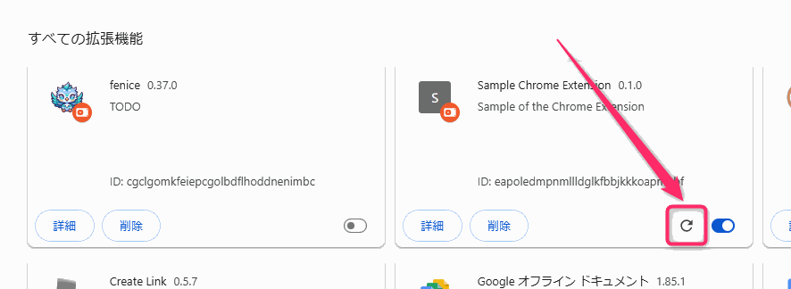

その後 ブラウザの任意の *ページをリロードする* と...

---

<!-- _class: full lead -->


---

## 特定のページだけに適応させたい

`manifest.json` で適当するサイトのURLを設定します。

```json
{
  "manifest_version": 3,
  "name": "Sample Chrome Extension",
  "description": "Sample of the Chrome Extension",
  "version": "0.1.0",
  "content_scripts": [
    {
      "matches": ["https://minerva.mamansoft.net/*"], // <all_urls> から具体的なURLのパターンに変更
      "css": ["main.css"]
    }
  ]
}
```

---

<!-- _class: chapter-divider -->

<div class="left">

### Chapter

## 03

</div>

<div class="right">

1. ~~真にミニマムな拡張作成~~
2. ~~見た目を変える拡張作成~~
3. **コンテンツをいじる拡張作成**
4. SPAのような拡張作成

</div>

---

<!-- _class: lead -->

### ページリンクをコピーするボタンをつくろう

---

## この拡張で行う2つのこと

- ページの右上にボタンを設置する
- ボタンを押したときページリンクテキストを作成してコピーする

---

## 必要なもの

| ファイル名      | 備考                           |
| -               | -                              |
| **`main.js`**   | *挙動を設定します*             |
| `main.css`      | 中身は刷新します               |
| `manifest.json` | 先ほどより少し項目を追加します |

---

## JavaScriptファイルの作成

ボタン要素の作成と押したときの挙動を `main.js` に書きます。

```js
const button = document.createElement("button");             // ボタン要素を作成

button.textContent = "ページリンクコピー";                      // ボタンに表示する文字列をセット
button.className = "copy-button";                            // ボタンのクラスをセット(CSSで使います)
button.addEventListener("click", async () => {               // ボタンが押されたときの処理をセット
  const title = document.querySelector("title").innerText;   // ページのタイトルを取得
  const url = window.location.href;                          // ページのURLを取得

  await navigator.clipboard.writeText(`[${title}](${url})`); // Markdownのリンク形式でクリップボードに登録

  alert(`リンクをコピーしました！\n${title}\n${url}`);           // コピー成功メッセージ
});

document.querySelector("body").appendChild(button);          // ボタンをページに追加
```

---

## CSSファイルの編集

ボタンを画面右上に常に表示する設定を `main.css` に書きます。

```css
.copy-button {
  position: absolute;  /* ページ内の絶対座標で位置を指定 */
  top: 8px;            /* 上から8pxの位置 */
  right: 16px;         /* 右端から16pxの位置 */

  cursor: pointer;     /* カーソルがあたったらポインタアイコンを表示 */

  z-index: 10000;      /* どの要素よりも手前に表示 */
}
```

---

## manifest.jsonの編集

`main.js` を `main.css` 同様に読み込み対象へ追加します。

```json
{
  "manifest_version": 3,
  "name": "Sample Chrome Extension",
  "description": "Sample of the Chrome Extension",
  "version": "0.1.0",
  "content_scripts": [
    {
      "matches": ["https://minerva.mamansoft.net/*"],
      "css": ["main.css"],
      "js": ["main.js"] // コレを追加
    }
  ]
}
```

---

## リロードしてサイトにアクセスしてみると...

<div class="center h-full text-6xl">

[Home \- Minerva](https://minerva.mamansoft.net/Home)

</div>

---

## 開発のヒント _Chrome devtoolsを使おう_

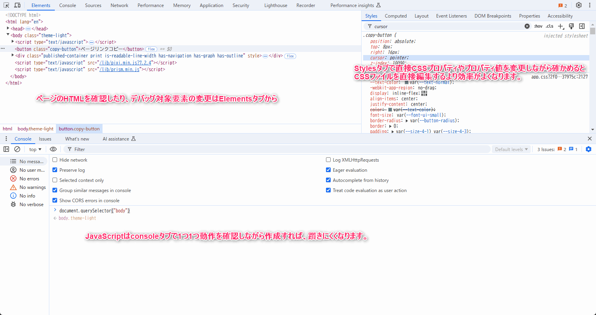

<footer>

[Chrome DevTools  \|  Chrome for Developers](https://developer.chrome.com/docs/devtools?hl=ja)

</footer>

---

<!-- _class: chapter-divider -->

<div class="left">

### Chapter

## 04

</div>

<div class="right">

1. ~~真にミニマムな拡張作成~~
2. ~~見た目を変える拡張作成~~
3. ~~コンテンツをいじる拡張作成~~
4. **SPAのような拡張作成**

</div>

---

<!-- _class: lead -->

<div class="text-orange-500">

## <i class="nf nf-cod-warning"></i> ここから一気に難易度が上がります

</div>

---

<!-- _class: lead -->

### Web開発をしていてこう思ったことありませんか?
### 私はあります。

---

- **ちょっとした便利ツールをつくってみたけどデプロイ先がない**

---

- ~~ちょっとした便利ツールをつくってみたけどデプロイ先がない~~
- **デプロイ先は見つかった...けどCORSに悩まされる**
  - **かといってサーバー立てたくはない(サーバーレス含む)**

---

- ~~ちょっとした便利ツールをつくってみたけどデプロイ先がない~~
- ~~デプロイ先は見つかった...けどCORSに悩まされる~~
  - ~~かといってサーバー立てたくはない(サーバーレス含む)~~
- **ElectronやTauriでクロスプラットフォーム対応バイナリつくる?**
  - **面倒くさそうだしバイナリサイズ大きくなりそう...** 

---

- ~~ちょっとした便利ツールをつくってみたけどデプロイ先がない~~
- ~~デプロイ先は見つかった...けどCORSに悩まされる~~
  - ~~かといってサーバー立てたくはない(サーバーレス含む)~~
- ~~ElectronやTauriでクロスプラットフォーム対応バイナリつくる?~~
  - ~~面倒くさそうだしバイナリサイズ大きくなりそう...~~ 
- **みんなにNode.jsやDeno入れてもらって起動コマンドを実行してもらって...**
  - **開発者以外の人がそんなことするわけないじゃないか**

---

- ~~ちょっとした便利ツールをつくってみたけどデプロイ先がない~~
- ~~デプロイ先は見つかった...けどCORSに悩まされる~~
  - ~~かといってサーバー立てたくはない(サーバーレス含む)~~
- ~~ElectronやTauriでクロスプラットフォーム対応バイナリつくる?~~
  - ~~面倒くさそうだしバイナリサイズ大きくなりそう...~~ 
- ~~みんなにNode.jsやDeno入れてもらって起動コマンドを実行してもらって...~~
  - ~~開発者以外の人がそんなことするわけないじゃないか~~
- **Chrome拡張ならなんとかなるのでは...!?**
  - **今さら JavaScript/HTML/CSS の世界に戻れないよ**

---

- ~~ちょっとした便利ツールをつくってみたけどデプロイ先がない~~
- ~~デプロイ先は見つかった...けどCORSに悩まされる~~
  - ~~かといってサーバー立てたくはない(サーバーレス含む)~~
- ~~ElectronやTauriでクロスプラットフォーム対応バイナリつくる?~~
  - ~~面倒くさそうだしバイナリサイズ大きくなりそう...~~ 
- ~~みんなにNode.jsやDeno入れてもらって起動コマンドを実行してもらって...~~
  - ~~開発者以外の人がそんなことするわけないじゃないか~~
- ~~Chrome拡張ならなんとかなるのでは...!?~~
  - ~~今さら JavaScript/HTML/CSS の世界に戻れないよ~~
- **TypeScriptとReact/Vueとかでサクっと作れればなぁ...**

---

## 次世代Web拡張フレームワーク WXT

<iframe src="https://wxt.dev/" width="100%" height="540" frameborder="0" allowfullscreen class="mt-6"></iframe>

<footer>

[Next\-gen Web Extension Framework – WXT](https://wxt.dev/)

</footer>

---

## WXTのすごいところ

- 多くのブラウザをサポート
  - Chrome, Firefox, Edge, Safari, その他 Chromiumベースのブラウザに対応
- **デフォルトでTypeScriptをサポート**
- **主要フレームワークをサポート**
  - Reacta, Vue, Svelte, Solid, ... etc
- **ファイルベースのエントリポイントサポート**
- **ホットリロードサポート**
- Viteプラグインサポート
- ルーティングサポート
- Auto-imports サポート

---

<!-- _class: lead -->

## Vue開発者のわたしから見て、一言で言うと...

---

<!-- _class: lead -->

<style scoped>
code {
  font-size: 0.75rem;
}
</style>


> あ…ありのまま 今　起こった事を話すぜ！
> 
> おれはWXTで開発をしていたと思ったらいつのまにか **`nuxt.config.ts`** を探していた…
> 
> な…　何を言ってるのか　わからねーと思うがおれも何をされたのかわからなかった…　頭がどうにかなりそうだった…

---

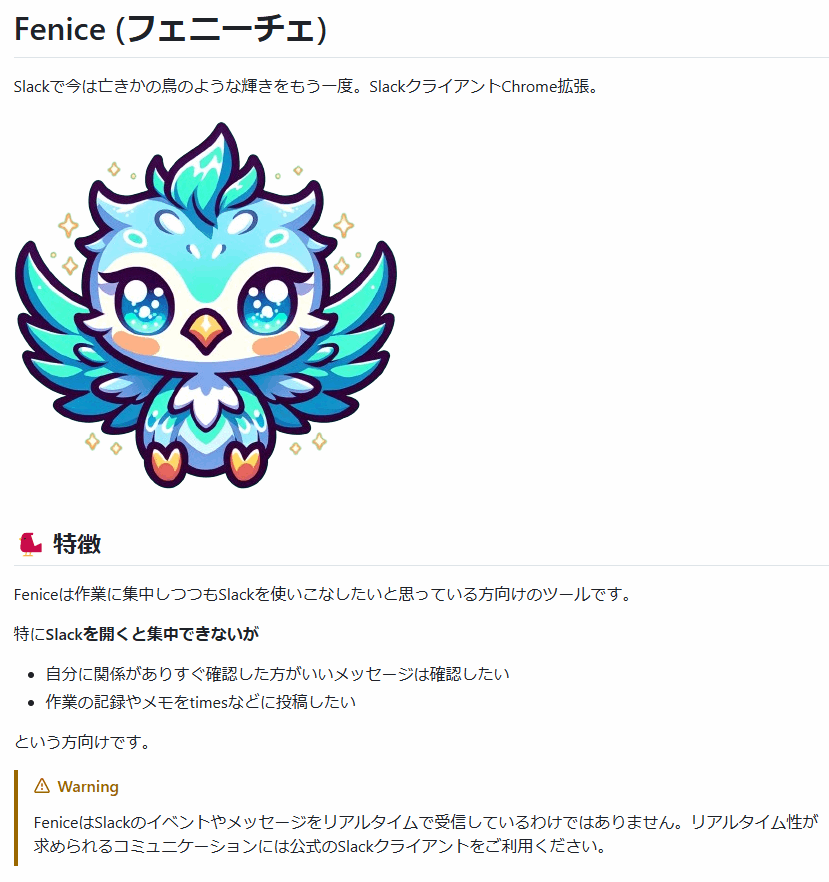

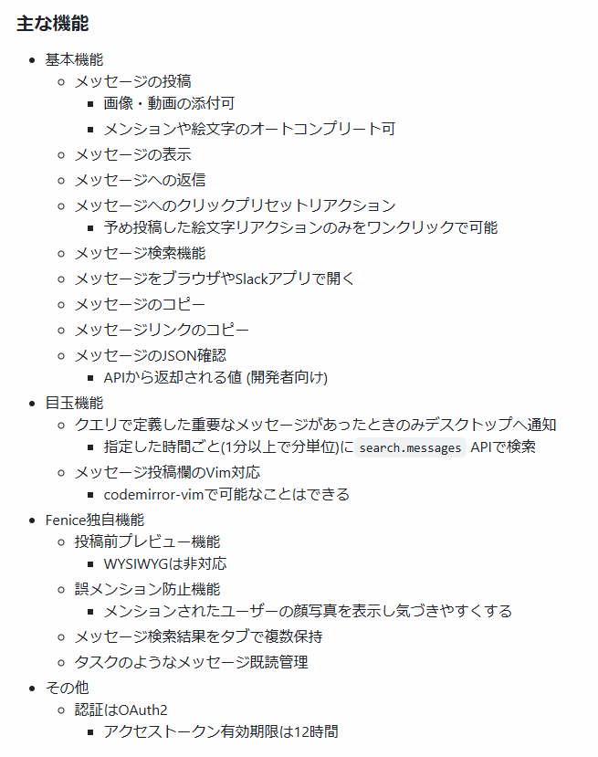

<footer>

[tadashi\-aikawa/fenice](https://github.com/tadashi-aikawa/fenice)

</footer>

---

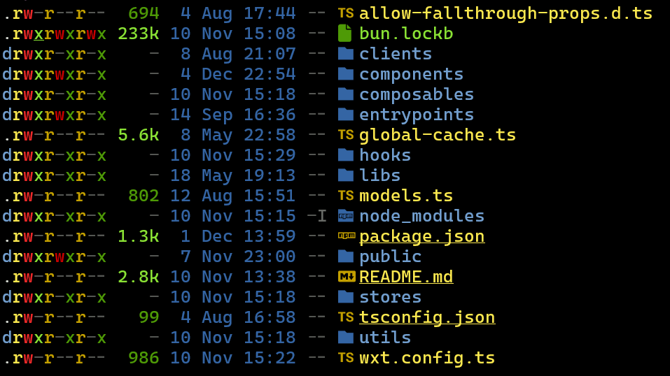

<div class="tag-note">
Feniceのプロジェクトルート
</div>

---

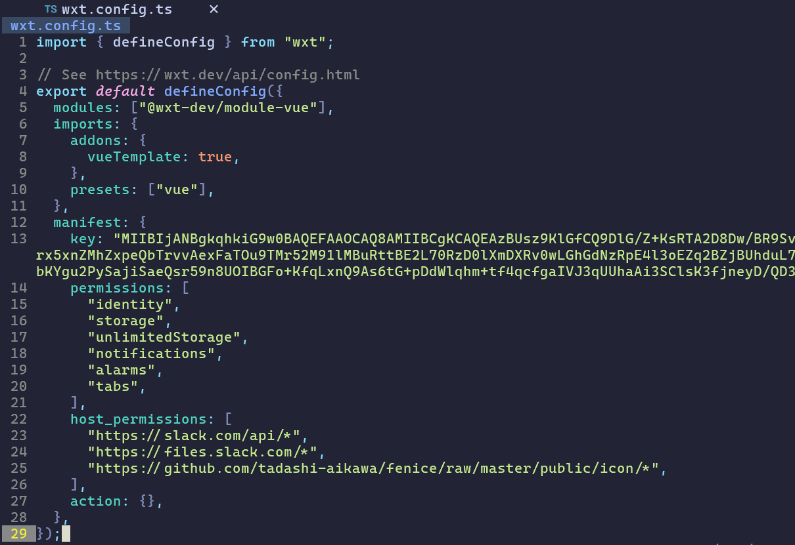

<div class="tag-note">
Feniceのwxt.config.ts
</div>

---

## entrypointsが重要

<div class="grid-col-3-7" style="align-items: start">

<div>

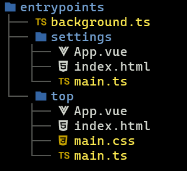

</div>

<div>

- `entrypoints` 配下のディレクトリがパスになる
  - `chrome-extension://<拡張ID>/top.html` で トップへ
  - `chrome-extension://<拡張ID>/settings.html` で 設定へ
- 一部名称は予約語としてChrome拡張が認識する
  - `popup` はポップアップの実装
  - `background` はService Worker
  - `content` はContent Scripts
- 各endpointでそれぞれVueが初期化される
  - `index.html` -> `main.ts` -> `App.vue` の順で初期化
- 単一endpoint内のルーティングも可能(らしい)
  - ハッシュモードが必要

</div>

</div>

---

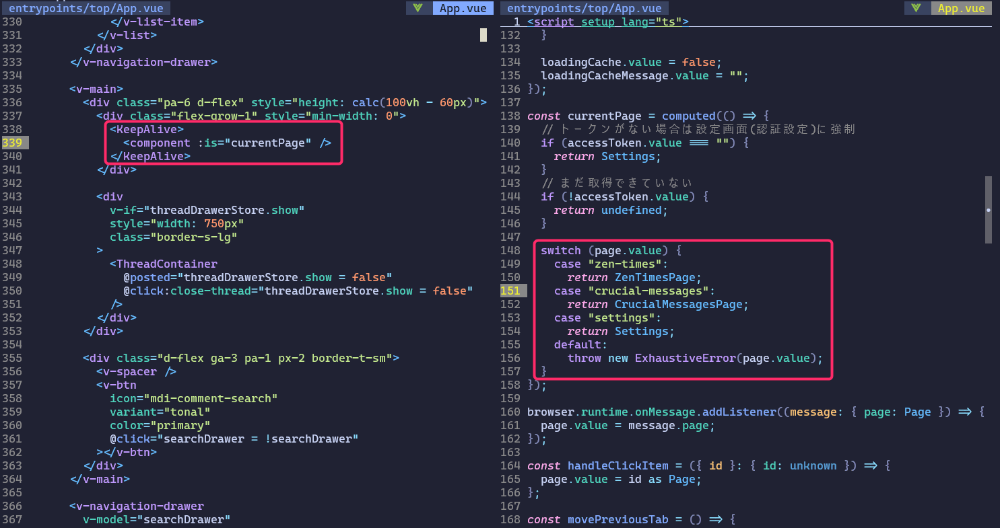

<div class="tag-note">
Feniceの top/App.vue では KeepAlive とcomponent :is を使って疑似的な複数ページを表現している
</div>

---

## まとめ

- Web初心者の方向け
  - `manifest.json` だけでChrome拡張はできる
  - 見た目を変えるならCSSファイルを書く
  - 操作をするならJavaScriptファイルを書く
- Web中級者以上の方向け
  - WXTを使うといつものWeb開発と同じノリでChrome拡張開発ができる
