<script src="https://cdn.tailwindcss.com/3.4.4"></script>
<script>tailwind.config = { corePlugins: { preflight: false } }</script>

<!-- _class: slide-title -->

<div class="title">
  <div>抜け出せないターミナルをつくろう</div>
</div>
<div class="name">Tadashi Aikawa</div>
<div class="date-and-event">2024/12/15 Minerva Lightning Talks</div>

---


<style scoped>
.item {
  display: flex;
  align-items: center;
  gap: 0.75em;
}
</style>

<div>
  <h1 class="text-foreground">Tadashi Aikawa</h1>
  <h5 class="text-dimmed">Productivity Creator since 2010</h5>
  <div class="mt-12 space-y-2 text-2xl">
    <div class="item">
      <div class="label">OS</div>
      <span>Windows <small>(開発はUbuntu on WSL)</small></span>
    </div>
    <div class="item">
      <div class="label">ターミナル</div>
      <span>Windows Terminal / WezTerm (secondary)</span>
    </div>
    <div class="item">
      <div class="label">言語</div>
      <span>TypeScript >> Python = Go > Lua > Rust</span>
    </div>
    <div class="item">
      <div class="label">エディタ</div>
      <span>Neovim / Obsidian</span>
    </div>
    <div class="item">
      <div class="label">デバイス</div>
      <span>EIZO / HHKB Studio / SlimBlade</span>
    </div>
    <div class="item">
      <div class="label">サイト</div>
      <a href="https://minerva.mamansoft.net/">Minerva</a>
      <a href="https://github.com/tadashi-aikawa">GitHub</a>
      <a href="https://bsky.app/profile/tadashi-aikawa.bsky.social">
        Bluesky
      </a>
    </div>
    <div class="item">
      <div class="label">好き</div>
      <span>創作活動・温泉・甘味・動物(ぬいぐるみ含む)</span>
    </div>
    <div class="item">
      <div class="label">苦手</div>
      <span>お酒・車・勉強</span>
    </div>
    <div class="item">
      <div class="label">楽しい仕事</div>
      <span>個人やチームの生産性を上げて成果に繋げる</span>
    </div>
  </div>
</div>

<!-- 仕事だったら『所属』『代表プロダクト』『入社年』などを入れる -->

---

<!-- _class: chapter-divider -->

<div class="left">

### Agenda

</div>

<div class="right">

1. ターミナルを使う理由
2. ターミナルエミュレーターを選ぶ
3. Zshの設定を整える
4. オススメツール
5. まとめ

</div>

---

<!-- _class: chapter-divider -->

<div class="left">

### Chapter

## 01

</div>

<div class="right">

1. **ターミナルを使う理由**
2. ターミナルエミュレーターを選ぶ
3. Zshの設定を整える
4. オススメツール
5. まとめ

</div>

---

<!-- _class: lead -->

# なぜターミナルを使うのか?

---

## わたしがターミナルを使う7つの理由

1. *軽い*
2. *作業スピードが向上し自動化もしやすい*
3. 表示がシンプルで集中しやすい
4. 好きな数・サイズのウィンドウ/タブを扱える
5. エディタでNeovimを使うことが多いので親和性が高い
6. かっこいい
7. どこかで必要になるので

---

## ターミナルが嫌われる3つの理由

- 今の状況が分からない
  - 表現が乏しく情報も少なすぎるので...
- 操作のコマンドが分からない
  - コマンドを覚えないといけないので...
- 操作に時間がかかる
  - 毎回コマンドを打ち込んだり、履歴から探すので...

---

## 視点を問題に変えると...

- 情報が少ない
- コマンドがわからない
- コマンドを打つのに時間がかかる
- コマンドを履歴から探すのに時間がかかる

---

<!-- _class: lead -->

<div class="center">

> 最高のサービスを受けたことのない人は最高のサービスを提供できない。
> 己の体験がサービスの限界を決めてしまうのだ。

</div>

---

## 視点を問題に変えると...

- 情報が少ない
- コマンドがわからない
- コマンドを打つのに時間がかかる
- コマンドを履歴から探すのに時間がかかる

<div class="center pt-24">

*これらの問題を解決できる最高のターミナル環境をつくろう*

</div>

---

<!-- _class: lead -->

<div class="center">

> **Don't think. Feel.** 
> (考えるな。感じろ。)
> 
> **It's like a finger pointing at the moon.**
> (これは月を指で指すようなものだ。)
> 
> **Don't concentrate on the finger, or you will miss all that heavenly glory.**
> (指に集中するな。さもないと栄光を見失うぞ。)
> [映画『燃えよドラゴン』 リーの台詞](https://ja.wikipedia.org/wiki/%E7%87%83%E3%81%88%E3%82%88%E3%83%89%E3%83%A9%E3%82%B4%E3%83%B3)

</div>

---

<!-- _class: chapter-divider -->

<div class="left">

### Chapter

## 02

</div>

<div class="right">

1. ~~ターミナルを使う理由~~
2. **ターミナルエミュレーターを選ぶ**
3. Zshの設定を整える
4. オススメツール
5. まとめ

</div>

---

## ターミナルエミュレーターとは

『ターミナル』と呼んでいる黒い画面のアプリケーションのこと。

> 端末エミュレータ（たんまつエミュレータ、英: terminal emulator）とは、端末のエミュレーションを行うソフトウェアで、専用端末の代わりに使えるソフトウェアである。英語をそのままカタカナにしてターミナルエミュレータとも表記する。ターミナルソフト（英: terminal software）やターミナルアプリケーション（英: terminal applicationともいう。
> [端末エミュレータ \- Wikipedia](https://ja.wikipedia.org/wiki/%E7%AB%AF%E6%9C%AB%E3%82%A8%E3%83%9F%E3%83%A5%E3%83%AC%E3%83%BC%E3%82%BF)

<div class="note">※ 以降は単に『ターミナル』と呼びます</div>

---

## 最近よく使われているターミナル

| ターミナル         | 開発元           | <i class="nf nf-fa-windows"></i> | <i class="nf nf-fa-apple"></i> | <i class="nf nf-fa-linux"></i> | ★     | 開発言語      |
| -                  | -                | -                                | -                              | -                              | -     | -             |
| [Windows Terminal] | Microsoft        | ◎                                |                                |                                | 96.1k | C++           |
| [Alacritty]        | Alacritty        | o                                | o                              | o                              | 56.9k | Rust          |
| [kitty]            | Kovid Goyal氏    |                                  | o                              | o                              | 25.0k | 色々          |
| [Warp]             | Warp             |                                  | o                              | o                              | 21.6k | Rust          |
| [WezTerm]          | Wez Furlong氏    | o                                | o                              | o                              | 18.3k | Rust          |
| [iTerm2]           | George Nachman氏 |                                  | o                              |                                | 15.5k | Objective-C   |
| [Wave Terminal]    | Wave             | o                                | o                              | o                              | 6.2k  | TypeScript/Go |

<div class="note gap-8">

<div>◎: 標準インストール</div>
<div>o: 利用可能</div>

</div>

[Windows Terminal]: https://github.com/microsoft/terminal
[iTerm2]: https://iterm2.com/
[WezTerm]: https://wezfurlong.org/wezterm/
[Alacritty]: https://alacritty.org/
[kitty]: https://sw.kovidgoyal.net/kitty/
[Warp]: https://www.warp.dev/
[Wave Terminal]: https://www.waveterm.dev/

---

## ターミナルを決める上で大事にしていること

- *応答スピード*
  - 許容できるラグは10ms以下
- *マルチバイト文字列対応状況*
  - 特に日本語と絵文字
- *タブ機能があるか*
  - tmuxやZellijのようなターミナルマルチプレクサは使わないので
- *表示にノイズが出ないか?*
  - 特にNeovim利用時
- **いつものSSHフローでちゃんと動くか**
  - SSHフローによって動作は変わるので
  - 回避ルートがあれば許容できる

---

<!-- _class: chapter-divider -->

<div class="left">

### Chapter

## 03

</div>

<div class="right">

1. ~~ターミナルを使う理由~~
2. ~~ターミナルエミュレーターを選ぶ~~
3. **Zshの設定を整える**
4. オススメツール
5. まとめ

</div>

---

## Zshとは

**対話型**を重視して設計されたシェル。

> Zsh is a shell designed for interactive use, although it is also a powerful scripting language. Many of the useful features of bash, ksh, and tcsh were incorporated into zsh; many original features were added.
[ZSH \- THE Z SHELL](https://zsh.sourceforge.io/)

<div class="note">ここ数年のMac OSではデフォルトのシェル</div>

<footer>

[ZSH \- THE Z SHELL](https://zsh.sourceforge.io/)

</footer>

---

## Zshのカスタマイズ _コマンド履歴の利便性向上_

`~/.zshrc`

```bash
# コマンド履歴で過去の重複は削除 / 別セッションと履歴を共有
setopt histignorealldups sharehistory
# 永続化する履歴ファイルのパスを指定
HISTFILE=~/.zsh_history
# シェル実行中にメモリへ保存するコマンド履歴の最大数
HISTSIZE=1000
# .zsh_historyに書きこまれるコマンド履歴の最大数
SAVEHIST=1000
```

---

## Zshのカスタマイズ _オートコンプリート設定_

`~/.zshrc`

```bash
autoload -Uz compinit
compinit

# 高度な補完
zstyle ':completion:*' completer _expand _complete _correct _approximate
# 大文字小文字や各種記号をfuzzyに考慮して補完
zstyle ':completion:*' matcher-list '' 'm:{a-z}={A-Z}' 'm:{a-zA-Z}={A-Za-z}' 'r:|[._-]=* r:|=* l:|=*'
# ドットファイルを.はじまりでなくても補完
setopt globdots
```

---

## zsh-autosuggestions _人間に優しいコマンドサジェスト_ `★31.7k`

```bash
sudo apt install -y zsh-autosuggestions
echo "source /usr/share/zsh-autosuggestions/zsh-autosuggestions.zsh" >> ~/.zshrc
```

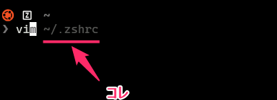

<footer>

[zsh\-users/zsh\-autosuggestions: Fish\-like autosuggestions for zsh](https://github.com/zsh-users/zsh-autosuggestions)

</footer>

---

<!-- _class: chapter-divider -->

<div class="left">

### Chapter

## 04

</div>

<div class="right">

1. ~~ターミナルを使う理由~~
2. ~~ターミナルエミュレーターを選ぶ~~
3. ~~Zshの設定を整える~~
4. **オススメツール**
5. まとめ

</div>

---

<!-- _class: lead -->

## ここからはひたすらオススメツールを紹介

---

<!-- _class: lead -->

### まずは *インストールしないと作業/仕事ができない* ものから

---

## mise _開発環境構築に特化したCLIツール_ `★11.8k`

- 直感的なコマンド
- バージョン切り替えも楽々
- 高パフォーマンス


<div class="center">

<iframe src="https://tadashi-aikawa.github.io/slides/202408-mise-starship/" width="720px" height="350px" ></iframe>

</div>

<footer>

[Home \| mise\-en\-place](https://mise.jdx.dev/)

</footer>

---

## Starship _ターミナルの見た目を楽々カスタマイズ_ `★45.8k`

- 直感的な設定
- 高いカスタマイズ性
- あらゆるOS/シェルを同一の設定で


<div class="center">

<iframe src="https://tadashi-aikawa.github.io/slides/202408-mise-starship/" width="720px" height="350px" ></iframe>

</div>

<footer>

[Starship](https://starship.rs/)

</footer>

---

## Neovim _至高のエディタ_ `★84.1k`

- 個人的にはすべてをNeovimでやっているため、これナシでは始まらない
  - ただ普通の人にはあまりオススメしないのも事実...

<div class="center flex-col text-2xl">


[📘Neovimを使ったことがなかったころの君へ \- Minerva](https://minerva.mamansoft.net/%F0%9F%93%98Articles/%F0%9F%93%98Neovim%E3%82%92%E4%BD%BF%E3%81%A3%E3%81%9F%E3%81%93%E3%81%A8%E3%81%8C%E3%81%AA%E3%81%8B%E3%81%A3%E3%81%9F%E3%81%93%E3%82%8D%E3%81%AE%E5%90%9B%E3%81%B8)

</div>

<footer>

[Home \- Neovim](https://neovim.io/)

</footer>

---

## Lazygit _至高のTUI Gitクライアント_ `★54.2k`

- 開発中のGit操作はほぼLazygit

<div class="center flex-col text-2xl">


[📘Lazygitを自分好みにカスタマイズしてみた \- Minerva](https://minerva.mamansoft.net/%F0%9F%93%98Articles/%F0%9F%93%98Lazygit%E3%82%92%E8%87%AA%E5%88%86%E5%A5%BD%E3%81%BF%E3%81%AB%E3%82%AB%E3%82%B9%E3%82%BF%E3%83%9E%E3%82%A4%E3%82%BA%E3%81%97%E3%81%A6%E3%81%BF%E3%81%9F)

</div>

<footer>

[jesseduffield/lazygit: simple terminal UI for git commands](https://github.com/jesseduffield/lazygit)

</footer>

---

## Lazydocker _至高のTUI Dockerクライアント_ `★39.3k`

- Dockerの状態確認や単純な操作はすべてlazydocker
- ちまちまdockerコマンド打っていた日々には二度と戻れない

<div class="center">
  <video muted controls src="./resources/lazydocker.webm" height="400"></video>
</div>

<footer>

[jesseduffield/lazydocker: The lazier way to manage everything docker](https://github.com/jesseduffield/lazydocker)

</footer>

---

## fzf _ファジー検索機能の提供_ `★66.2k`

- ファジー検索(曖昧検索)で絞り込み選択するUIを提供 (標準出力と連携可能)
- バンドルされているイチオシ機能は *コマンド履歴の実行*

<div class="center">
  <video muted controls src="./resources/fzf.webm" height="400"></video>
</div>

<footer>

[fzf \| junegunn\.choi\.](https://junegunn.github.io/fzf/)

</footer>

---

## Zoxide _いわゆる瞬間移動ってやつだ_ `★23.4k`

- `z <移動したい場所の部分文字列>` で **過去の移動履歴** を考慮して移動
- `zi <移動したい場所の部分文字列>` で複数の候補をfzfで絞り込むこともできる

<div class="center">
  <video muted controls src="./resources/zoxide.webm" height="400"></video>
</div>

<footer>

[ajeetdsouza/zoxide: A smarter cd command\. Supports all major shells\.](https://github.com/ajeetdsouza/zoxide)

</footer>

---

## delta _gitでも使える人間のためのdiff_ `★24.8k`

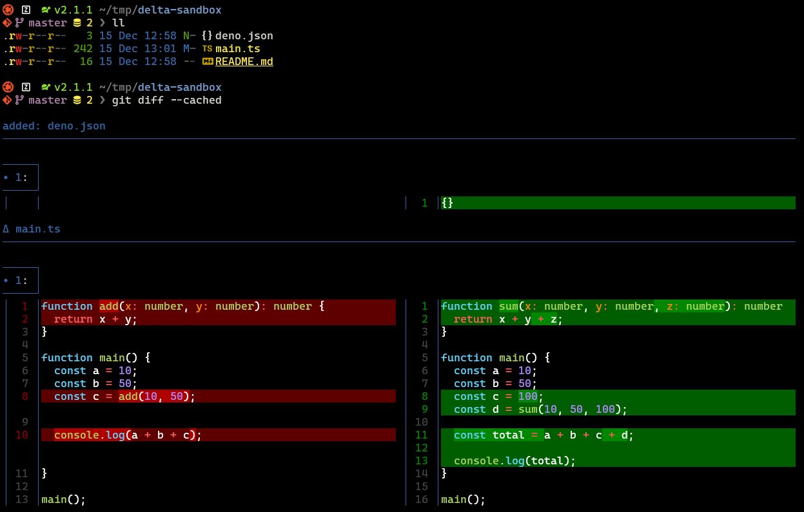

<footer>

[Introduction \- delta](https://dandavison.github.io/delta/)

</footer>

---

## ripgrep _grepより数倍高速。しかも優しい_ `★49.2k`

- `rg <文字列>` でカレントディレクトリ配下を再帰的にイイ感じにgrepしてくれる
- 全文検索機能を ripgrep で提供しているツールは多い

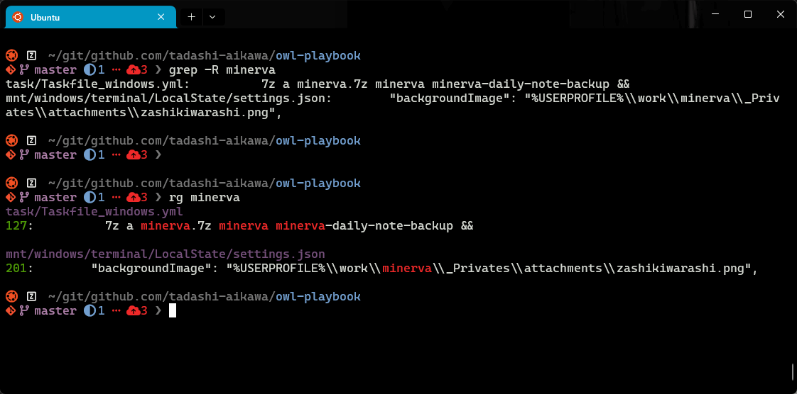

<footer>

[BurntSushi/ripgrep: ripgrep recursively searches directories for a regex pattern while respecting your gitignore](https://github.com/BurntSushi/ripgrep)

</footer>

---

## eza _美しいlsの代替_ `★12.9k`

- カラー表示、アイコン表示、Gitステータス、ツリー表示 などに対応
- `ll` や `tree` のaliasを作成して利用する

```bash
alias tree="eza --icons -T --no-user"
alias ll="eza --icons -l --git --no-user"
```

<div class="center gap-4">

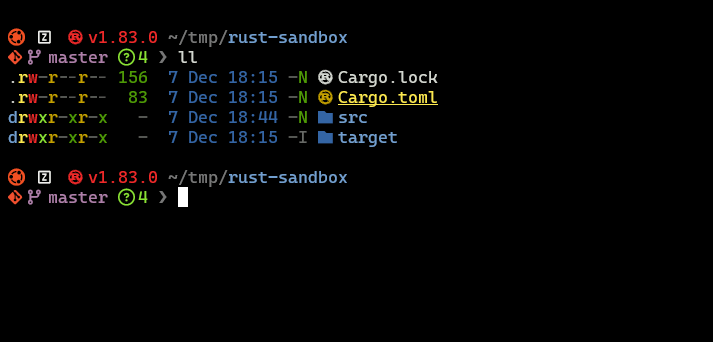

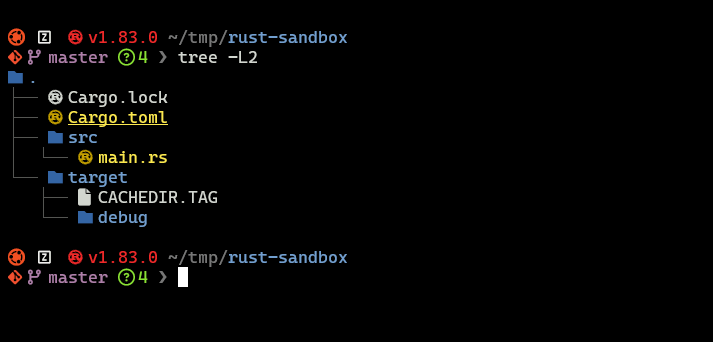

</div>


<footer>

[eza \| A modern, maintained replacement for ls, written in rust](https://eza.rocks/)

</footer>

---

## fd _優しくて高速なfindの代替_ `★34.5k`

- `fd <文字列>` でカレントディレクトリ配下を再帰的にイイ感じにfindしてくれる
- ファイル検索機能を fd で提供しているツールは多い

<div class="center gap-16">

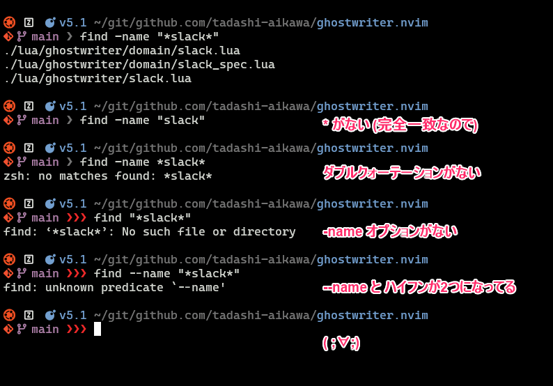

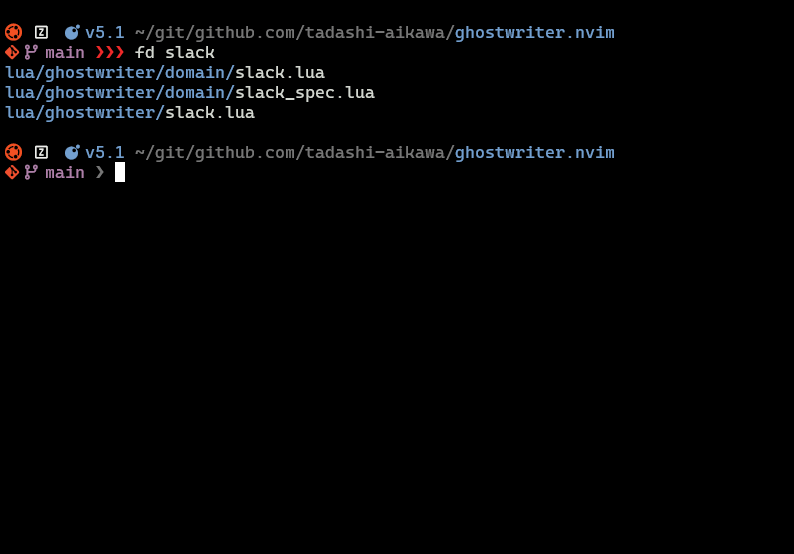

</div>

<footer>

[sharkdp/fd: A simple, fast and user\-friendly alternative to 'find'](https://github.com/sharkdp/fd)

</footer>

---

## dust _ディレクトリのデータ容量確認に_ `★9.1k`

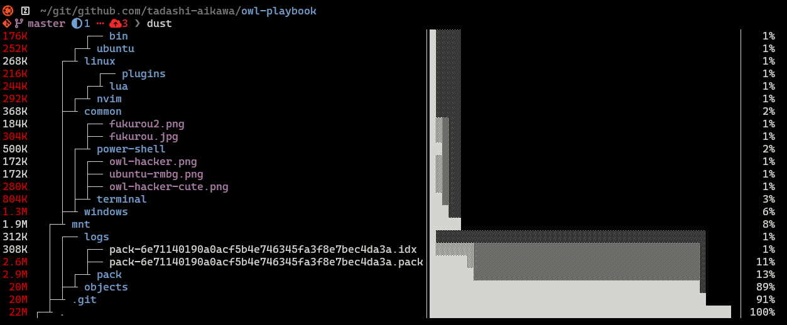

<footer>

[bootandy/dust: A more intuitive version of du in rust](https://github.com/bootandy/dust)

</footer>

---

<!-- _class: lead -->

### 必須ではないけどあったら便利なもの

---

## bottom _優しくてクールなtop_ `★10.4k`

<div class="center mt-8">
  <video muted controls src="./resources/bottom.webm" height="560"></video>
</div>

<footer>

[Home \- bottom](https://clementtsang.github.io/bottom/stable/)

</footer>

---

## Lazysql _Lazyの意志を継しTUIのSQLクライアント_ `★984`

- テーブルのデータを一瞬見たいときに便利

<div class="center flex-col text-2xl">


[📘Lazyなエンジニアに贈る SQLクライアントツール『Lazysql』 \- Minerva](https://minerva.mamansoft.net/%F0%9F%93%98Articles/%F0%9F%93%98Lazy%E3%81%AA%E3%82%A8%E3%83%B3%E3%82%B8%E3%83%8B%E3%82%A2%E3%81%AB%E8%B4%88%E3%82%8B+SQL%E3%82%AF%E3%83%A9%E3%82%A4%E3%82%A2%E3%83%B3%E3%83%88%E3%83%84%E3%83%BC%E3%83%AB%E3%80%8ELazysql%E3%80%8F)

</div>

<footer>

[jorgerojas26/lazysql: A cross\-platform TUI database management tool written in Go\.](https://github.com/jorgerojas26/lazysql)

</footer>

---

## xh _より便利なcurlのRust実装_ `★5.7k`

<div class="center gap-4">

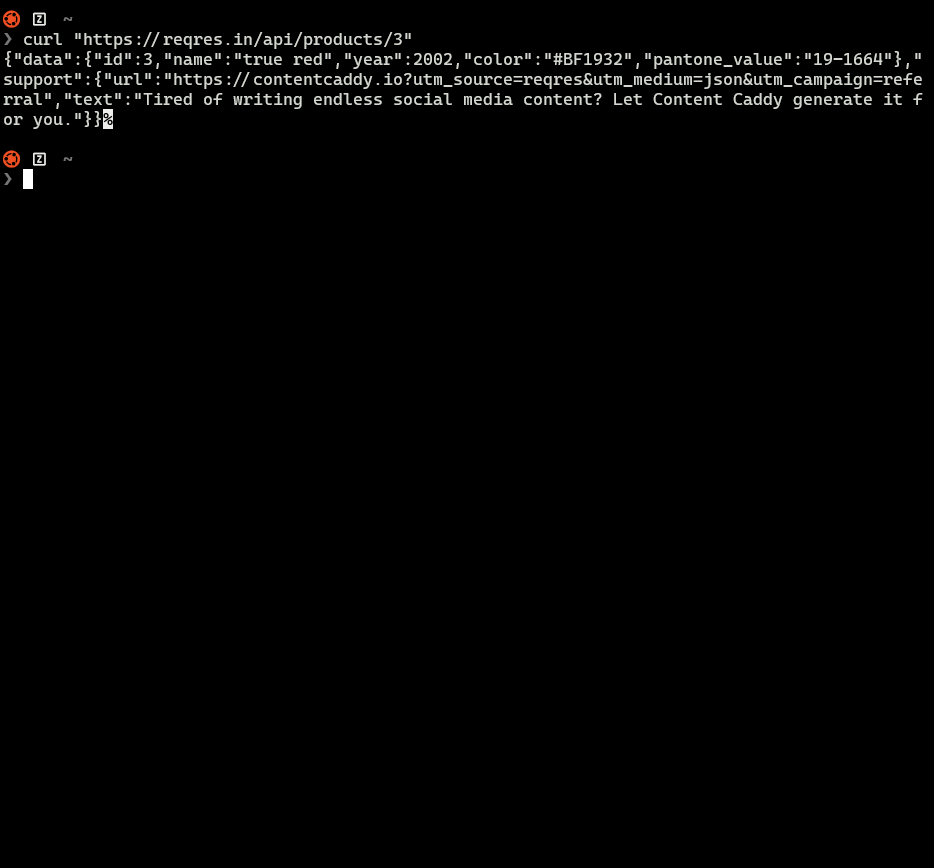

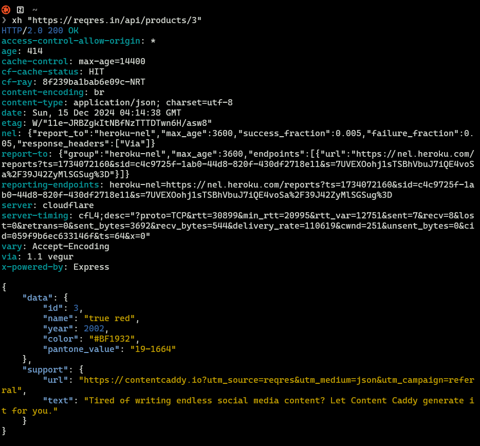

</div>

<footer>

[ducaale/xh: Friendly and fast tool for sending HTTP requests](https://github.com/ducaale/xh)

</footer>

---

## bat _綺麗なcat_ `★50.1k`

- Neovimを使っていなければ必要

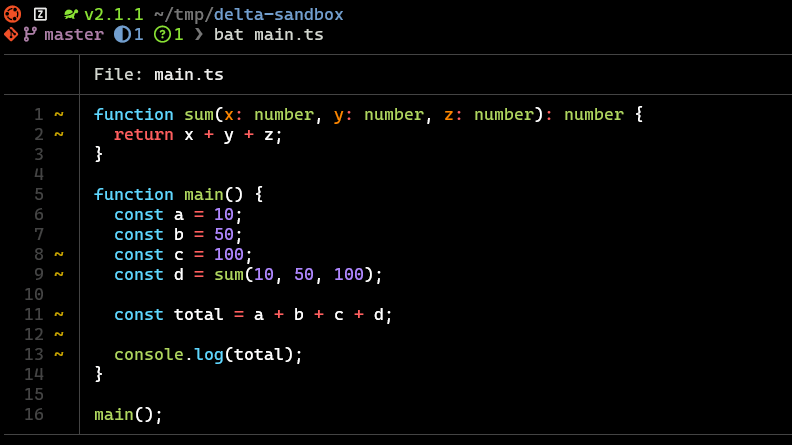

<footer>

[sharkdp/bat: A cat\(1\) clone with wings\.](https://github.com/sharkdp/bat)

</footer>

---

## Broot _より良いディレクトリナビゲーションの追求_ `★10.9k`

- ターゲットを決めてからアクションを指定するのが特徴的

<div class="center">
  <video muted controls src="./resources/broot.webm" height="480"></video>
</div>

<footer>

[Broot](https://dystroy.org/broot/)

</footer>

---

<!-- _class: chapter-divider -->

<div class="left">

### Chapter

## 05

</div>

<div class="right">

1. ~~ターミナルを使う理由~~
2. ~~ターミナルエミュレーターを選ぶ~~
3. ~~Zshの設定を整える~~
4. ~~オススメツール~~
5. **まとめ**

</div>

---

## まとめ

- *デメリットを打ち消せる* ターミナル環境をつくろう
- 自分にあったターミナルエミュレーターを使おう
- *『履歴』『オートコンプリート』* に関するZshのカスタマイズをしよう
- 必須のツールは *Game Changer* となるのでインストールしよう

---

## 付録 _紹介ツール一覧 ★多い順_

<div class="grid-col-5-5 text-[55%] p-8" style="align-items: baseline">

<div class="center flex-col">

### 必須なもの

| ツール名   | 一言説明                             | スター数 |
| -          | -                                    | -        |
| Neovim     | 至高のエディタ                       | 84.1k    |
| fzf        | ファジー検索機能の提供               | 66.2k    |
| Lazygit    | 至高のTUI Gitクライアント            | 54.2k    |
| ripgrep    | grepより数倍高速。しかも優しい       | 49.2k    |
| Starship   | ターミナルの見た目を楽々カスタマイズ | 45.8k    |
| Lazydocker | 至高のTUI Dockerクライアント         | 39.3k    |
| fd         | 優しくて高速なfindの代替             | 34.5k    |
| delta      | gitでも使える人間のためのdiff        | 24.8k    |
| Zoxide     | いわゆる瞬間移動ってやつだ           | 23.4k    |
| eza        | 美しいlsの代替                       | 12.9k    |
| mise       | 開発環境構築に特化したCLIツール      | 11.8k    |
| dust       | ディレクトリのデータ容量確認に       | 9.1k     |

</div>

<div class="center flex-col">

### あったら便利なもの

| ツール名 | 一言説明                                 | スター数 |
| -        | -                                        | -        |
| bat      | 綺麗なcat                                | 50.1k    |
| xh       | より便利なcurlのRust実装                 | 5.7k     |
| Broot    | より良いディレクトリナビゲーションの追求 | 10.9k    |
| bottom   | 優しくてクールなtop                      | 10.4k    |
| Lazysql  | Lazyの意志を継しTUIのSQLクライアント     | 984      |

</div>

</div>

<div class="note">※ 必須かどうかはtadashi-aikawa個人の場合に限った話</div>

