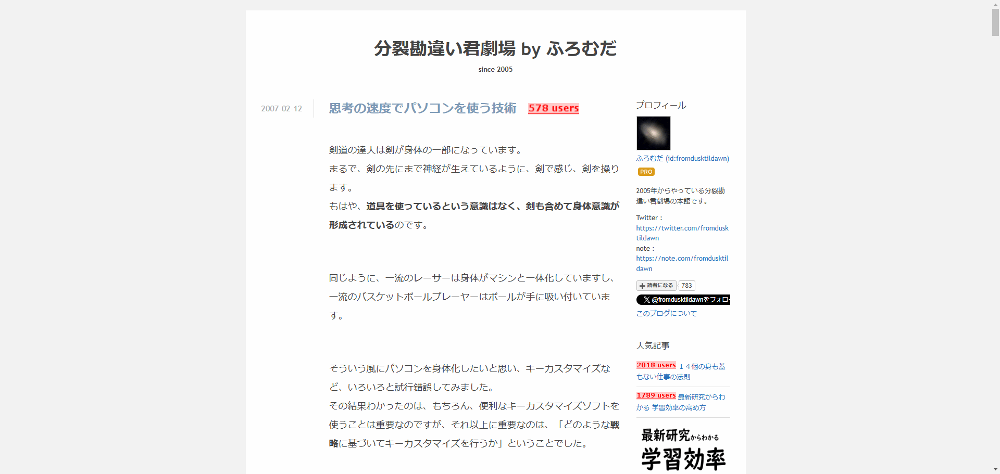
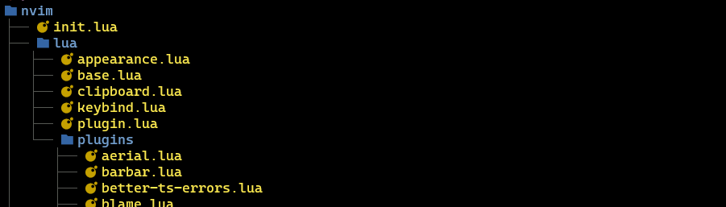
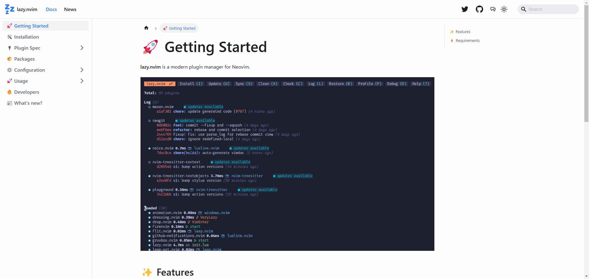

<script src="https://cdn.tailwindcss.com/3.4.4"></script>
<script>tailwind.config = { corePlugins: { preflight: false } }</script>

<!-- _class: slide-title relateive -->

<div class="title">
  <div>ビーマの神殿</div>
</div>
<div class="name">Tadashi Aikawa</div>
<div class="date-and-event">2024/12/26 Minerva Lightning Talks</div>

---


<style scoped>
.item {
  display: flex;
  align-items: center;
  gap: 0.75em;
}
</style>

<div>
  <h1 class="text-foreground">Tadashi Aikawa</h1>
  <h5 class="text-dimmed">Productivity Creator since 2010</h5>
  <div class="mt-12 space-y-2 text-2xl">
    <div class="item">
      <div class="label">OS</div>
      <span>Windows <small>(開発はUbuntu on WSL)</small></span>
    </div>
    <div class="item">
      <div class="label">ターミナル</div>
      <span>Windows Terminal / WezTerm (secondary)</span>
    </div>
    <div class="item">
      <div class="label">言語</div>
      <span>TypeScript >> Python = Go > Lua > Rust</span>
    </div>
    <div class="item">
      <div class="label">エディタ</div>
      <span>Neovim / Obsidian</span>
    </div>
    <div class="item">
      <div class="label">デバイス</div>
      <span>EIZO / HHKB Studio / SlimBlade</span>
    </div>
    <div class="item">
      <div class="label">サイト</div>
      <a href="https://minerva.mamansoft.net/">Minerva</a>
      <a href="https://github.com/tadashi-aikawa">GitHub</a>
      <a href="https://bsky.app/profile/tadashi-aikawa.bsky.social">
        Bluesky
      </a>
    </div>
    <div class="item">
      <div class="label">好き</div>
      <span>創作活動・温泉・甘味・動物(ぬいぐるみ含む)</span>
    </div>
    <div class="item">
      <div class="label">苦手</div>
      <span>お酒・車・勉強</span>
    </div>
    <div class="item">
      <div class="label">楽しい仕事</div>
      <span>個人やチームの生産性を上げて成果に繋げる</span>
    </div>
  </div>
</div>

<!-- 仕事だったら『所属』『代表プロダクト』『入社年』などを入れる -->

---

<!-- _class: lead -->

<div class="dq">
  <div>＊『ここは 転職をつかさどる ビーマの神殿。</div>
  <div>　　エディタを かえたい者が 来るところじゃ。』</div>
</div>

---

<!-- _class: lead -->

<div class="dq">
  <div>＊『転職を ごきぼうか？』</div>
</div>

---

<!-- _class: lead -->

<div class="dq">
  <div>＊『そなたは Vimmerに なりたいと 申すか？』</div>
</div>

---

<!-- _class: lead -->

<div class="dq">
  <div>＊『いちど VSCodeをアンインストールし</div>
  <div>　　修行をしなおす覚悟も おありじゃな？』</div>
</div>

---

<!-- _class: chapter-divider -->

<div class="left">

### Agenda

</div>

<div class="right">

1. 一流アスリートの資質
2. Vimmerになるまでの旅路
3. 常人とVimmer 思考の違い
4. なぜNeovimか?
5. 本気でNeovimをはじめよう

</div>

---

<!-- _class: chapter-divider -->

<div class="left">

### Chapter

## 01

</div>

<div class="right">

1. **一流アスリートの資質**
2. Vimmerになるまでの旅路
3. 常人とVimmer 思考の違い
4. なぜNeovimか?
5. 本気でNeovimをはじめよう

</div>

---

<!-- _class: lead -->

<div class="dq">
  <div>＊『はじめに大事なことをお伝えしよう。』</div>
</div>

---

<!-- _class: lead -->

<div class="dq">
  <div>＊『Vimはスポーツじゃ。』</div>
</div>

---

## 一流アスリートに必要なモノ _心技体_

- 心
  - 集中力
- 技
  - 技術力
- 体
  - 操作スピード・稼働時間

---

## 一流アスリートに必要なモノ _心技体_

- 心
  - 集中力
- 技
  - 技術力
- 体
  - *操作スピード・稼働時間*

---

## 操作スピード・稼働時間(≒ 持久力)

- 指の押下回数が少ない
- 押下に対する指の負担が小さい
- 指の移動距離が短い
- 視界・首の移動が少ない
- 考えない(無意識)
- 視界にノイズが少ない

---

## 道具は良いものを使おう

- [📗良いキーボードを使う \- Minerva](https://minerva.mamansoft.net/%F0%9F%93%97Productivity%E3%82%92%E4%B8%8A%E3%81%92%E3%82%8B%E3%81%9F%E3%82%81%E3%81%AB%E5%A4%A7%E5%88%87%E3%81%AA100%E3%81%AE%E3%81%93%E3%81%A8/%F0%9F%93%97%E8%89%AF%E3%81%84%E3%82%AD%E3%83%BC%E3%83%9C%E3%83%BC%E3%83%89%E3%82%92%E4%BD%BF%E3%81%86)
  - 押下に対する指の負担が小さい
  - 指の移動距離が短い
- [📗無刻印キーボードを使う \- Minerva](https://minerva.mamansoft.net/%F0%9F%93%97Productivity%E3%82%92%E4%B8%8A%E3%81%92%E3%82%8B%E3%81%9F%E3%82%81%E3%81%AB%E5%A4%A7%E5%88%87%E3%81%AA100%E3%81%AE%E3%81%93%E3%81%A8/%F0%9F%93%97%E7%84%A1%E5%88%BB%E5%8D%B0%E3%82%AD%E3%83%BC%E3%83%9C%E3%83%BC%E3%83%89%E3%82%92%E4%BD%BF%E3%81%86)
  - 視界・首の移動が少ない
  - **視界にノイズが少ない**

---

<!-- _class: chapter-divider -->

<div class="left">

### Chapter

## 02

</div>

<div class="right">

1. ~~一流アスリートの資質~~
2. **Vimmerになるまでの旅路**
3. 常人とVimmer 思考の違い
4. なぜNeovimか?
5. 本気でNeovimをはじめよう

</div>

---

## 思考の速度でパソコンを使う技術 _2012年_



<footer>

[思考の速度でパソコンを使う技術 \- 分裂勘違い君劇場 by ふろむだ](https://www.furomuda.com/entry/20070212/1171244226)

</footer>

---

## AutoHotkey _2012年_


<footer>

[AutoHotkey](https://www.autohotkey.com/)

</footer>

---

## AutoHotkeyで実現したこと

- 仮想キーボードレイヤー
  - 5つのモード(NORMAL/EDIT/RANGE/MOUSE/SPECIAL)
- 戦略的キーバインド
  - コンビネーションとホームポジション
    - [📗頻繁に使う遠いキーの位置を近づける \- Minerva](https://minerva.mamansoft.net/%F0%9F%93%97Productivity%E3%82%92%E4%B8%8A%E3%81%92%E3%82%8B%E3%81%9F%E3%82%81%E3%81%AB%E5%A4%A7%E5%88%87%E3%81%AA100%E3%81%AE%E3%81%93%E3%81%A8/%F0%9F%93%97%E9%A0%BB%E7%B9%81%E3%81%AB%E4%BD%BF%E3%81%86%E9%81%A0%E3%81%84%E3%82%AD%E3%83%BC%E3%81%AE%E4%BD%8D%E7%BD%AE%E3%82%92%E8%BF%91%E3%81%A5%E3%81%91%E3%82%8B)
    - [📗共通キーバインド戦略を採用する \- Minerva](https://minerva.mamansoft.net/%F0%9F%93%97Productivity%E3%82%92%E4%B8%8A%E3%81%92%E3%82%8B%E3%81%9F%E3%82%81%E3%81%AB%E5%A4%A7%E5%88%87%E3%81%AA100%E3%81%AE%E3%81%93%E3%81%A8/%F0%9F%93%97%E5%85%B1%E9%80%9A%E3%82%AD%E3%83%BC%E3%83%90%E3%82%A4%E3%83%B3%E3%83%89%E6%88%A6%E7%95%A5%E3%82%92%E6%8E%A1%E7%94%A8%E3%81%99%E3%82%8B)
    - [📗抽象的な操作を指先で覚える \- Minerva](https://minerva.mamansoft.net/%F0%9F%93%97Productivity%E3%82%92%E4%B8%8A%E3%81%92%E3%82%8B%E3%81%9F%E3%82%81%E3%81%AB%E5%A4%A7%E5%88%87%E3%81%AA100%E3%81%AE%E3%81%93%E3%81%A8/%F0%9F%93%97%E6%8A%BD%E8%B1%A1%E7%9A%84%E3%81%AA%E6%93%8D%E4%BD%9C%E3%82%92%E6%8C%87%E5%85%88%E3%81%A7%E8%A6%9A%E3%81%88%E3%82%8B)
  - Neovimとは相乗効果がある
    - [📘AutoHotkeyが織りなすNeovimの魅力 \- Minerva](https://minerva.mamansoft.net/%F0%9F%93%98Articles/%F0%9F%93%98AutoHotkey%E3%81%8C%E7%B9%94%E3%82%8A%E3%81%AA%E3%81%99Neovim%E3%81%AE%E9%AD%85%E5%8A%9B)

---

<!-- _class: lead -->

<div class="center">

> **Don't think. Feel.** 
> (考えるな。感じろ。)
> 
> **It's like a finger pointing at the moon.**
> (これは月を指で指すようなものだ。)
> 
> **Don't concentrate on the finger, or you will miss all that heavenly glory.**
> (指に集中するな。さもないと栄光を見失うぞ。)
> [映画『燃えよドラゴン』 リーの台詞](https://ja.wikipedia.org/wiki/%E7%87%83%E3%81%88%E3%82%88%E3%83%89%E3%83%A9%E3%82%B4%E3%83%B3)

</div>

---

## 実践Vimとの邂逅 _2018年_


<footer>

[実践Vim 思考のスピードで編集しよう\! \| Drew Neil, 新丈径 \|本 \| 通販 \| Amazon](https://www.amazon.co.jp/%E5%AE%9F%E8%B7%B5Vim-%E6%80%9D%E8%80%83%E3%81%AE%E3%82%B9%E3%83%94%E3%83%BC%E3%83%89%E3%81%A7%E7%B7%A8%E9%9B%86%E3%81%97%E3%82%88%E3%81%86-Drew-Neil/dp/4048916599)

</footer>

---

<!-- _class: chapter-divider -->

<div class="left">

### Chapter

## 03

</div>

<div class="right">

1. ~~一流アスリートの資質~~
2. ~~Vimmerになるまでの旅路~~
3. **常人とVimmer** 思考の違い
4. なぜNeovimか?
5. 本気でNeovimをはじめよう

</div>

---

<!-- _class: lead -->

<div class="dq">
  <div>＊『常人とVimmerには思考の癖という点において</div>
  <div>　　大きく2つの違いがあるのじゃ。』</div>
</div>

---

<!-- _class: lead -->

<div class="dq">
  <div>＊『それは 命令が <b>抽象的</b>...</div>
  <div>　　...かつ <b>再利用可能</b> なことじゃ。』</div>
</div>

---

## Vimmerの思考

- 抽象的な命令
  - **どこ(where)** に **何(what)** の操作をするか?
    - モーション
    - テキストオブジェクト
    - オペレータ
- 命令の再利用
  - コーディングの関数と同じ
  - 具体例
    - ドットコマンド
    - マクロ

---

## 常人の思考

<div class="grid-col-5-5" style="align-items: baseline">

<div>

```yaml
# before
version: "3"
services:
  minio:
    image: quay.io/minio/minio
    ports:
      - 9000:9000
      - 9001:9001
    environment:
      minio_root_user: user
      minio_root_password: password
    command: server /data
```

</div>

<div>

```yaml
# after
version: "3"
services:
  minio:
    image: quay.io/minio/minio
    ports:
      - 9000:9000
      - 9001:9001
    environment:
      MINIO_ROOT_USER: user
      MINIO_ROOT_PASSWORD: password
    command: server /data
```

</div>

</div>

<div class="dq mt-8 text-2xl">
  <div>＊『minio_root_user をダブルクリック -> MINIO_ROOT_USER と入力</div>
  <div>　　minio_root_password をダブルクリック -> MINIO_ROOT_PASSWORD と入力』</div>
</div>

---

## Vimmerの思考

<div class="grid-col-5-5" style="align-items: baseline">

<div>

```yaml
# before
version: "3"
services:
  minio:
    image: quay.io/minio/minio
    ports:
      - 9000:9000
      - 9001:9001
    environment:
      minio_root_user: user
      minio_root_password: password
    command: server /data
```

</div>

<div>

```yaml
# after
version: "3"
services:
  minio:
    image: quay.io/minio/minio
    ports:
      - 9000:9000
      - 9001:9001
    environment:
      MINIO_ROOT_USER: user
      MINIO_ROOT_PASSWORD: password
    command: server /data
```

</div>

</div>

<div class="dq mt-8 text-2xl">
  <div><i class="nf nf-custom-neovim"></i>『minio_root_user に乗って(smij)、大文字に変換(gUiw)。</div>
  <div>　　下に移動して繰り返し(j.) じゃ』</div>
</div>

---

<!-- _class: chapter-divider -->

<div class="left">

### Chapter

## 04

</div>

<div class="right">

1. ~~一流アスリートの資質~~
2. ~~Vimmerになるまでの旅路~~
3. ~~常人とVimmer~~ 思考の違い
4. **なぜNeovimか?**
5. 本気でNeovimをはじめよう

</div>

---

## Neovimの特徴

- **超**高速
  - 『見たまえ。私のNeovimを。起動時間はわずか18msだ!!』
- Vimとの機能的互換性 + 独自機能
  - 強力なVimの機能を享受しつつモダンな機能を搭載
- プラグインシステム
  - 自分好みの外見にできる
  - 必要な情報のみを必要なタイミングで表示できる
  - よりよい操作性を追求できる
  - **しかも自分でも作れる(Lua or TypeScript)**

---

## Neovimを使い始めたきっかけ _❤️‍🔥Burningなプロジェクトに参賀_

- Windowsだと動かなかった
  - WSL内のUbuntu環境で開発
- VSCodeだと重かった
  - Goプロジェクトなのに
- 左の席の人も右の席の人もNeovimを使ってた
  - もうやるしかない

---


<!-- _class: chapter-divider -->

<div class="left">

### Chapter

## 05

</div>

<div class="right">

1. ~~一流アスリートの資質~~
2. ~~Vimmerになるまでの旅路~~
3. ~~常人とVimmer~~ 思考の違い
4. ~~なぜNeovimか?~~
5. **本気でNeovimをはじめよう**

</div>

---

<!-- _class: lead -->

> 無理だと思わないことが一番大事だと思います。
> 無理だと思ったら終わりです。
> [大谷翔平の名言：無理だと思わないことが一番大事だと思います。無理だと思ったら終わりです。](https://jp.pinterest.com/pin/1092334084608810820/)

---

<!-- _class: lead -->

> 努力は必ず報われる。
> もし報われない努力があるのならば、それはまだ努力と呼べない。
> [王貞治の名言：努力は必ず報われる。もし報われない努力があるのならば、それはまだ努力と呼べない。](https://jp.pinterest.com/pin/610589662004577634/)

---

## 真のNeovimmerになるまでの段階 (一例)

1. IDE + Vimプラグイン
2. Neovimを触って挫折する
3. VSCode + vscode-neovim
4. Neovim + LazyVim
5. Neovim + coc.nvim
6. Neovim + nvim-lspconfig

<div class="dq mt-16 text-2xl">
  <div><i class="nf nf-custom-neovim"></i>『わしは6年近くかかったぞい』</div>
</div>

---

## 真のNeovimmerになるまでの段階 (一例)

1. IDE + Vimプラグイン
2. Neovimを触って挫折する
3. VSCode + vscode-neovim
4. Neovim + LazyVim
5. Neovim + coc.nvim
6. *Neovim + nvim-lspconfig* `<- 今回はいきなりココを目指す`

---

## インストール

```bash
mise use -g neovim
```

`.zshrc`

```bash
# vimで起動したければ
alias vim=nvim
```

---

## 設定



TODO: 大事な設定

---

## プラグイン管理 _lazy.nvim_



<footer>

[🚀 Getting Started \| lazy\.nvim](https://lazy.folke.io/)

</footer>

---

## 開発に必須 _主観です_

| プラグイン                                                            | 概要                                   |
| -                                                                     | -                                      |
| [nvim-lspconfig](https://github.com/neovim/nvim-lspconfig)            | LSPとの架け橋                          |
| [nvim-treesitter](https://github.com/nvim-treesitter/nvim-treesitter) | 構文解析とシンタックスハイライト       |
| [nvim-cmp](https://github.com/hrsh7th/nvim-cmp/)                      | 補完機能                               |
| [conform.nvim](https://github.com/stevearc/conform.nvim)              | Linter & Formatter との架け橋          |
| [telescope.nvim](https://github.com/nvim-telescope/telescope.nvim)    | ファイル検索 & 全文検索                |
| [gitsigns.nvim](https://github.com/lewis6991/gitsigns.nvim)           | Gitの差分箇所を可視化                  |
| [barbar.nvim](https://github.com/romgrk/barbar.nvim)                  | タブのようなバッファUI                 |
| [lualine.nvim](https://github.com/nvim-lualine/lualine.nvim)          | ステータスライン・winbarのカスタマイズ |

---

<!-- _class: lead -->

<div class="dq mt-8 text-2xl">
  <div><i class="nf nf-custom-neovim"></i>『このNeovimはプラグインをインストールするたびにパワーがはるかに増す...</div>
  <div>　　そのプラグインをあと46個もオレは残している...</div>
  <div>　　その意味がわかるな？』</div>
</div>

---

## 深淵の入口をご案内

[](https://minerva.mamansoft.net/%F0%9F%93%98Articles/%F0%9F%93%982024%E5%B9%B4+Neovim%E6%88%90%E9%95%B7%E6%97%A5%E8%A8%98)
