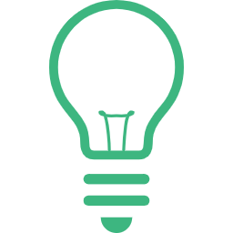
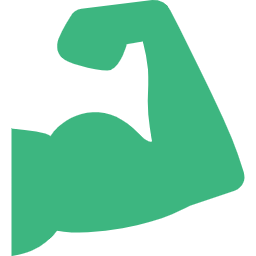
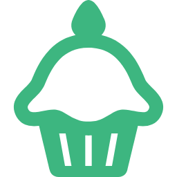

<!-- _class: slide-title -->

  
私のトリセツ

Tadashi Aikawa

2024/08/??

---

  <h1 class="text-foreground">Tadashi Aikawa</h1>
  <h5 class="text-dimmed">Productivity Creator since 2010</h5>
  

    

      
OS

      Windows <small>(開発はUbuntu on WSL)</small>
    

    

      
言語

      TypeScript >> Python = Go = Rust >> Lua
    

    

      
エディタ

      Neovim / Obsidian
    

    

      
デバイス

      EIZO / HHKB Studio / SlimBlade
    

    

      
サイト

      <a class="pl-3" href="https://minerva.mamansoft.net/">Minerva</a>
      <a class="pl-3" href="https://github.com/tadashi-aikawa">GitHub</a>
      <a class="pl-3" href="https://bsky.app/profile/tadashi-aikawa.bsky.social">
        Bluesky
      </a>
    

    

      
好き

      創作活動・温泉・甘味・動物(ぬいぐるみ含む)
    

    

      
苦手

      お酒・車・勉強
    

    

      
楽しい仕事

      個人やチームの生産性を上げて成果に繋げる
    

  

<!-- 仕事だったら『所属』『代表プロダクト』『入社年』などを入れる -->

---

<!-- _class: chapter-divider -->

### Agenda

1. 今やっている仕事
2. 今までにやってきた仕事
3. 得意/やる気が出る仕事
4. 苦手/やる気が出ない仕事
5. 仕事スタイル

---

<!-- _class: chapter-divider -->

### Chapter

## 01

1. **今やっている仕事**
2. 今までにやってきた仕事
3. 得意/やる気が出る仕事
4. 苦手/やる気が出ない仕事
5. 仕事スタイル

---

## TODO

- D: 運用改善業務とか
- K: SaaSとか
- Q: JとかTとか
- M: TとかVとか
- N: たまになにか

---

<!-- _class: chapter-divider -->

### Chapter

## 02

1. ~~今やっている仕事~~
2. **今までにやってきた仕事**
3. 得意/やる気が出る仕事
4. 苦手/やる気が出ない仕事
5. 仕事スタイル

---

## TODO

| year  | Org | Front         | API             | CLI               | DB                   | Infra            |
|-------|-----|---------------|-----------------|-------------------|----------------------|------------------|
| 2011- | 🚴  | `Android`     | `Java`          |                   |                      |                  |
| 2013- | A   |               | `Java` `Python` | `Python`          |                      | `On-prem`        |
| 2014- | G   | `React` `Vue` | `Python`        | **`Go`** `Rust`   | `PostgreSQL`         | `On-prem` `EC2`  |
| 2015- | D   | `React`       | `Scala`         |                   | `PostgreSQL`         | `EB` `EKS` `RDS` |
| 2018- | 🚌  | **`Vue`**     | `Node` `Rust`   | `Rust`            | `SQLite` **`MySQL`** | `S3`             |
| 2019- | Q   | `Angular`     |                 | `Python` **`Go`** | `DynamoDB`           |                  |
| 2021- | H   | **`Vue`**     | **`Go`**        |                   | `DynamoDB`           | `S3` `Lambda`    |
| 2023- | 💾  | **`Vue`**     | `Python`        | `Deno`            | **`MySQL`**          |                  |

---

<!-- _class: chapter-divider -->

### Chapter

## 03

1. ~~今やっている仕事~~
2. ~~今までにやってきた仕事~~
3. **得意/やる気が出る仕事**
4. 苦手/やる気が出ない仕事
5. 仕事スタイル

---

## 得意・やる気が出る仕事

  
1から何かをつくる

  
Productivity

  
ふんわり

  

  提供したい価値があり、作りたいモノや予定がハッキリ決まっていない状態から、動くモノをつくりながらプロダクトに仕上げていくのが好き。特に自分が使うモノだとやる気10倍。
  

  

  個人やチームの生産性を向上させるようなツール・仕組みをつくるのが好き。ただし、当人たちが望んでいる場合に限るので、外からの圧力で無理やり改善を進めていくのは好きじゃない。
  

  

  なんとなくやりたいことはあるのだけど、誰が何をどうやって進めるのかがフワフワしているモノを進めていくのは得意。いわゆる優しい丸投げ。好きかと言われると微妙な気はするけど。
  

